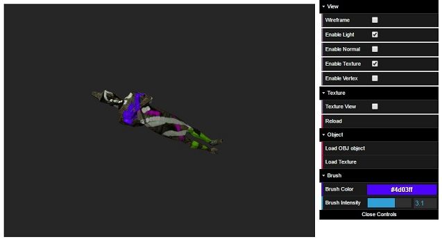
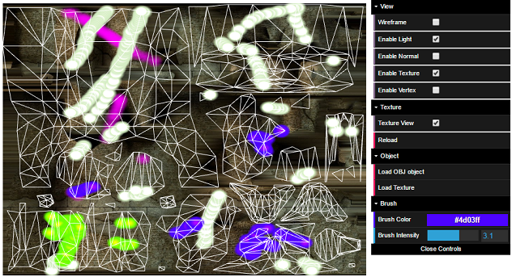

# WebGL 3D Painter

This is a 3D model painter develop for WebGL using HTML and Javascript. The idea is that the user can load and paint and object both in 3D and in UV coordinates using mouse clicks. It allows the loading of .obj files with texture coordinates and the loading of texture images. Obj files must supply normal and texture coordinates for the program to work properly

## External libraries

The following externa libraries/ projects were used in the develop of this program:

* [Sylvester.js 0.1.3](http://sylvester.jcoglan.com/), for matrix and vector manipulation
* [dat.GUI](https://github.com/dataarts/dat.gui), for easy GUI creation.

## External libraries

The following is an screenshot of the program usage in 3D:

  

And a screenshot to paint the object in UV coordinates:

  

